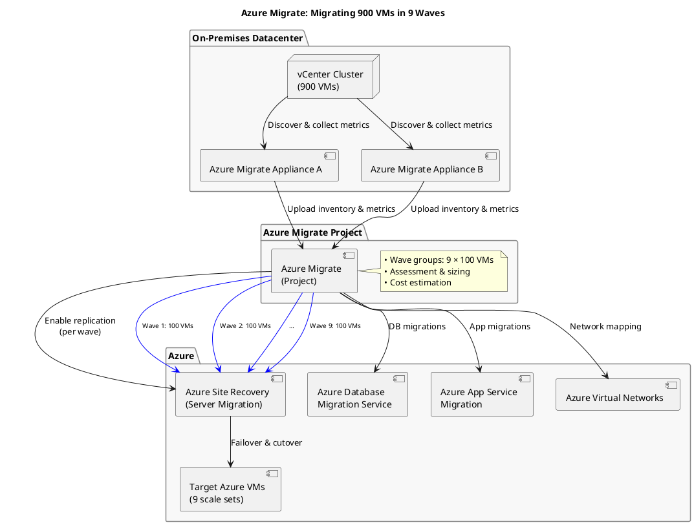

**Clarifying 900 VMs migration steps**

The user seems to need a specific, detailed workflow for migrating 900 VMs. They may want another PlantUML diagram with more specifics on the architecture, maybe including load balancers, scale sets, and VM grouping. In addition, I can provide a numbered list of migration steps: such as discovery, grouping into assessment groups, assessments, and migration in waves. This will be more comprehensive than just a high-level diagram, giving a deeper look into the process for 900 VMs.

Thought for 5 seconds

Below is a more detailed PlantUML diagram and a step-by-step example of migrating **900 VMs** in **9 waves** (100 VMs each), illustrating how you’d plan, assess, and execute the migration at scale.

---

## 900-VM Migration: Detailed 9-Wave Plan

Below is a realistic, end-to-end example of migrating **900 on-premises VMs** to Azure over **nine waves** of **100 VMs each**.

| Phase                            | Key Activities                                                                                                                                                                                                                                                                                                                           |
| -------------------------------- | ---------------------------------------------------------------------------------------------------------------------------------------------------------------------------------------------------------------------------------------------------------------------------------------------------------------------------------------- |
| **0. Planning**                  | • Inventory all 900 VMs and categorize by business unit, OS, application tier. • Define waves of 100 VMs balancing criticality, application dependencies, and network zones. • Estimate bandwidth: target 500 Mbps sustained for replication.                                                                                      |
| **1. Appliance Deployment**      | • Deploy two Azure Migrate appliances (HA) in on-prem vSphere cluster. • Appliances register to your Azure Migrate project.                                                                                                                                                                                                           |
| **2. Discovery**                 | • Appliances discover all 900 VMs over vCenter APIs. • Collect 14 days of performance data.                                                                                                                                                                                                                                           |
| **3. Assessment**                | • Create **9 assessment groups** (one per wave) of 100 VMs each. • Run readiness, OS compatibility, and performance-based sizing. • Generate cost estimates per wave.                                                                                                                                                              |
| **4. Network Mapping**           | • Map on-prem VLANs to Azure VNet subnets. • Plan NSGs, UDRs, and VPN/ExpressRoute connectivity.                                                                                                                                                                                                                                      |
| **5. Pilot Wave**                | • **Wave 1**: Select 100 low-risk VMs (e.g., dev/test). • Enable replication via Azure Site Recovery (ASR). • Perform a test failover to a non-prod VNet. • Validate application functionality and performance.                                                                                                                 |
| **6. Production Waves**          | For each wave (2 through 9), repeat:   1. **Enable replication** for the next 100 VMs.     2. **Monitor replication health** (dashboard in Azure Migrate).   3. **Test failover**: verify, then cleanup test resources.     4. **Planned failover & cutover**: switch production to Azure, decommission on-prem replication. |
| **7. Database & App Migration**  | • In parallel, use Azure Database Migration Service for SQL instances in each wave. • Use App Service Migration Assistant for web front-ends.                                                                                                                                                                                         |
| **8. Validation & Optimization** | • After each wave, validate SLAs, monitor Azure VM performance. • Adjust VM sizes, scaling policies, and Azure Reserved Instances to optimize costs.                                                                                                                                                                                  |
| **9. Decommission**              | • Once all 900 VMs are live in Azure, remove on-prem appliances and cleanup legacy infrastructure. • Archive final assessment and cost reports.                                                                                                                                                                                       |

---

### Notes & Tips

* **Wave sizing**: 100 VMs per wave keeps replication and cutover manageable—tweak based on actual bandwidth and team capacity.
* **High availability**: Deploy at least two appliances for load-balancing discovery traffic.
* **Testing**: Always perform a non-invasive test failover before cutover to catch configuration or network issues.
* **Cost control**: Use Azure Hybrid Benefit and Reserved Instances for Windows VMs to reduce compute costs by up to 80%.
* **Automation**: Script replication enabling and failover using Azure PowerShell or CLI to streamline repetitive steps.
